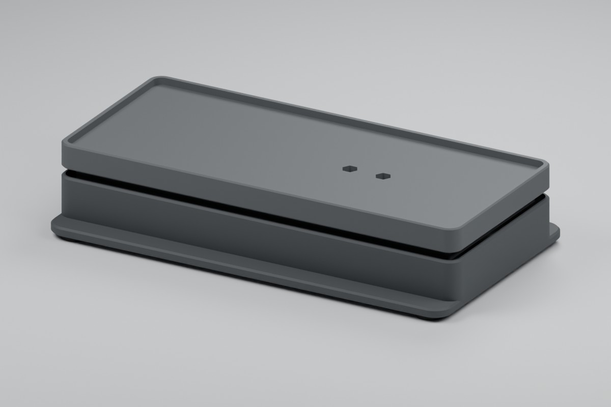

[](LICENSE)
[](https://github.com/fabianwimberger/esp32-filament-scale/actions/workflows/ci.yml)

# ESP32 Filament Scale



Printed weighing plinth for a SUNLU S2 filament dryer. An ESP32-C3 and an HX711 report the filament left on the spool to Home Assistant through ESPHome.

## Background

A filament dryer hides the spool, so the only way to know whether a roll will last for the next print is to open the lid and guess. Weighing the whole dryer answers that without touching it: capture the weight once with a fresh spool inside, and everything that disappears afterwards is filament.

The scale is a 180 × 80 mm floating top on a 180 × 100 mm base, 34 mm tall, built around a cheap 5 kg bar load cell. It carries the S2's feet inside a low rim; the dryer's body overhangs it.

## Features

- **Filament remaining in grams and percent** — counts down from the mass of the spool you loaded
- **Calibration from Home Assistant** — three buttons: empty platform, known mass, dryer with full spool; no reflashing
- **Persistent calibration** — zero, gain and spool capture survive reboots and OTA updates; there is no startup tare
- **Stability gate** — a five-second window rejects captures while the reading moves and drops missing, stale or saturated samples
- **Four printed parts, M3 only** — base, top and two click-in board caps; four M3 × 20 screws clamp the cell
- **Parametric CAD** — one OpenSCAD file with assertions for every screw length and clearance
- **Diagnostics** — raw counts, noise range, saved calibration, chip temperature and Wi-Fi signal

## Quick Start

```bash
git clone https://github.com/fabianwimberger/esp32-filament-scale.git
cd esp32-filament-scale

python -m venv .venv
.venv/bin/pip install esphome

.venv/bin/esphome run firmware/scale.yaml   # first flash over USB
```

Join the **Filament Scale Setup** access point to enter your Wi-Fi, then add the discovered device in Home Assistant. Later updates go over the air:

```bash
.venv/bin/esphome run firmware/scale.yaml --device filament-scale.local
```

Print the four files in [`printable/`](printable/) and follow the [Build Guide](docs/build.md) for parts, wiring, assembly and calibration. The [Design Notes](docs/design.md) cover load path, clearances and limits.

To change the CAD:

```bash
make meshes   # export printable/*.stl from cad/scale.scad
make images   # re-render docs/ (OpenSCAD and Blender)
make check    # host tests, mesh checks, ESPHome config validation
```

## How It Works

```
dryer + spool ──► floating top ──► 5 kg bar cell ──► HX711 ──► ESP32-C3 ──► Home Assistant
                  (touches nothing    (fixed end        5 samples/s  5 s window    ESPHome API
                   but the cell)       on the base)

filament remaining = gross mass − (dryer + empty spool)
```

The cell is a cantilever: its cable end is clamped to a pedestal in the base, its free end to the top. Nothing else connects the two, so every gram on the top passes through the cell.

Calibration stores three values. **1 Capture empty platform** saves the zero, **2 Capture calibration mass** the counts per gram, and **3 Capture dryer with full spool** subtracts **Full filament mass** from the reading and saves the rest as dryer plus empty spool. Repeat step 3 for every new spool, because empty spools differ in weight.

Weight estimates use the median of the latest 25 samples to suppress brief filament pulls. Sustained load changes reach the estimate after about 2.6 seconds at the normal sample rate, then publish on the next five-second update. Zero and reference-mass captures still use the unfiltered average, and noise and stability diagnostics retain every sample. Updating this filter requires no recalibration and preserves the saved calibration and spool tare through a normal OTA update.

The design target is ±10 g. Cable tension, filament pull during a print, heat and plastic creep all shift the reading, so treat it as a trend while printing.

## Configuration

Substitutions at the top of `firmware/scale.yaml`:

| Variable | Default | Description |
|---|---|---|
| `device_name` | `filament-scale` | ESPHome node name / hostname |
| `friendly_name` | `Filament Scale` | Display name in Home Assistant |
| `dout_pin` | `GPIO4` | HX711 DT / DOUT |
| `clock_pin` | `GPIO3` | HX711 SCK / CLK |

The config ships without API encryption or an OTA password; add both before using it on a shared network.

Settings in Home Assistant:

| Entity | Default | Description |
|---|---|---|
| Full filament mass | 1000 g | Filament on the spool when step 3 is pressed |
| Calibration mass | 1000 g | Mass of the reference object used in step 2 |
| Calibration noise limit | 1000 counts | Largest raw range over five seconds that steps 1 and 2 accept |

Parameters at the top of `cad/scale.scad` adapt the print to other hardware:

| Variable | Default | Description |
|---|---|---|
| `platform_length`, `platform_width` | `180`, `80` | Top; the rim leaves 175 × 75 mm for the dryer's feet |
| `cell_hole_spacing`, `cell_hole_end` | `15`, `5` | Hole pattern of the 80 × 12.7 × 12.7 mm cell |
| `fixed_side` | `-1` | End of the cell that is clamped to the base |
| `esp32_pcb`, `hx711_pcb` | measured | Board sizes the pockets are cut for |
| `esp32_wire_zone` | `[3.6,14.4]` | Where the ESP32 cap is notched for wires, from the USB edge |

## License

MIT — see [LICENSE](LICENSE).
