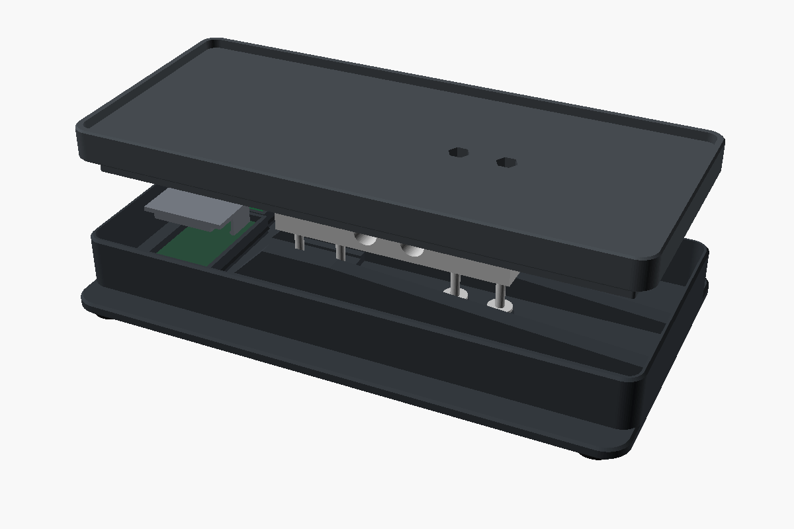

# Build Guide

Parts, wiring, printing, assembly and calibration. The reasoning behind the dimensions is in the [Design Notes](design.md).

## 1. Parts

| Qty | Part | Notes |
|---:|---|---|
| 1 | ESP32-C3 "super mini" board | 22.75 × 17.75 mm PCB, USB-C on a short edge, no pin headers |
| 1 | Bar load cell, 5 kg | 80 × 12.7 × 12.7 mm, four wires, two M4 and two M5 through-holes 15 mm apart, outer holes 5 mm from the ends |
| 1 | HX711 breakout | 34.35 × 21.06 mm, pad rows on both short ends |
| 4 | M3 × 20 socket head screws | ISO 4762 / DIN 912 |
| 4 | M3 nuts | |
| 4 | M3 washers, 8 mm OD | Up to 1 mm thick; required, the cell's holes leave an M3 head almost no bearing face |
| 4 | Rubber pads | 12 mm diameter, 2 mm thick, adhesive |
| 1 | USB-C cable and 5 V supply | |
| 1 | Known mass, about 1 kg | For calibration |

Check the cell before printing: 12.7 mm tall, through-holes, 15 mm hole spacing, and the potting over the strain gauges no more than 1 mm proud. Boards sold under the same name vary in size; compare yours with `esp32_pcb` and `hx711_pcb` in [`cad/scale.scad`](../cad/scale.scad). The 55 mm TAL220B and three-wire bathroom-scale sensors do not fit.

## 2. Print

| File | Orientation | Supports |
|---|---|---|
| `base.stl` | Floor down | None |
| `deck.stl` | Top up, flat on its underside | Under the 5.6 mm plate edge only, from the build plate |
| `esp32_cap.stl` | Top face down, legs up | None |
| `hx711_cap.stl` | Top face down, legs up | None |

All four files are exported in print orientation. PETG, six walls, six top and bottom layers, 50% gyroid infill. Print the cell pedestal in the base and the cell seat in the deck solid; a fully solid deck is about 40% stiffer.

After printing, check that an M3 nut drops to the bottom of both hex wells in the top face and that each cap clicks onto its empty pocket and pulls off again.

## 3. Wire

Solder the wires to the top of each board and trim anything that pokes through underneath.

| From | To |
|---|---|
| ESP32 3V3 | HX711 VCC |
| ESP32 GND | HX711 GND |
| ESP32 GPIO4 | HX711 DT |
| ESP32 GPIO3 | HX711 SCK |
| Cell red | HX711 E+ |
| Cell black | HX711 E− |
| Cell green | HX711 A+ |
| Cell white | HX711 A− |

Power a single-supply HX711 board from **3V3, never 5 V**: at 5 V its data line drives 5 V into the ESP32. A board with separate VCC and VDD pins takes 5 V on VCC and 3V3 on VDD. Cell wire colors vary; confirm them against your cell's drawing.

The ESP32 cap is notched for wires on the second to fifth pin from the USB edge (GND, 3V3, GPIO4, GPIO3 on the measured board). Change `esp32_wire_zone` if yours differ.

## 4. Assemble

1. Stick the four rubber pads under the corners of the base. They keep the screw heads and the two floor openings clear of the table.
2. Push an M3 × 20 up through each counterbore under the pedestal.
3. Lower the cell over the two screws, cable end into the slot between the pedestal lips, cable towards the boards. Which face is up does not matter.
4. Put a washer and a nut on each screw on top of the cell and tighten, holding the head with a hex key from below.
5. Drop the ESP32-C3 into the rear pocket with its USB-C connector in the wall notch, and the HX711 into the pocket in front of it with DT/SCK towards the ESP32. Lead the wires straight up and click both caps on.
6. Keep every wire at least 3 mm below the top of the cell and never route one over it. Leave a relaxed loop where the cable leaves the cell.
7. Lower the top onto the free end of the cell and drop a nut into each hex well.
8. From below, through the two floor openings, insert an M3 × 20 with a washer into each hole and tighten it into the nut. Before the last turn, square the top to the base so the gap is even all round; only clamp friction holds that angle.

Tighten moderately: the cell is aluminium and the seats are printed. Retighten after the first day under load.

The top must float. Check the 3.5 mm gap between top and base all round, with the dryer and the heaviest spool on it, and never fill it with foam or tape. If the top touches the base, a wire or a board, the reading is wrong.

There are no overload stops. Do not lean on the top, and lift the scale by its base. Keep the total load below 4 kg.

## 5. Flash

1. Connect the board over USB and run `esphome run firmware/scale.yaml`.
2. Join **Filament Scale Setup**, enter your Wi-Fi in the captive portal, and add the discovered ESPHome device in Home Assistant.
3. Press on the top and confirm that **Raw counts** changes within a few seconds.

To use an existing ESPHome installation instead, copy `scale.yaml` and `readings.h` together.

## 6. Calibrate

Let the scale warm up for ten minutes with its cables in their final routing. Wait ten seconds after each load change. Every button answers through **Setup message**.

1. Clear the top and press **1 Capture empty platform**.
2. Set **Calibration mass** to the mass of your reference object, put it on the center of the top and press **2 Capture calibration mass**.
3. Remove the reference. **Gross mass** should return to about zero.
4. Put the dryer on the top with a full spool inside, lid closed, cables routed as in use.
5. Set **Full filament mass** to the filament on that spool: 1000 g for a new 1 kg roll, or what is left on a used one.
6. Press **3 Capture dryer with full spool**. Wait 15 seconds before removing power so the values are saved.

Repeat steps 4 to 6 for every new spool. Steps 1 and 2 only need repeating after a mechanical change.

A rejected capture means the reading was still moving. **Raw noise range** shows by how much; find the cause before raising **Calibration noise limit**.

**Calibration zero** and **Calibration counts per gram** publish the saved values. Note them: they are lost if the flash is erased.

## 7. Verify

| Check | Procedure | Target |
|---|---|---|
| Repeatability | Remove and replace a known 1 kg mass five times | Within ±10 g |
| Off-center load | Same mass at the center and near each dryer foot | Within ±10 g, top never touches the base |
| Cables | Move the slack in the dryer's power cable and the filament path | No lasting shift above 10 g |
| Heat | Same load cold, after 30 and 120 minutes of drying, and cooled down | Note the drift; set alerts wider than it |
| Reboot | Power-cycle with a partly used spool installed | Same estimate, no tare |

The cell is temperature-compensated up to 40 °C and rated to 55 °C. **Electronics temperature** is the ESP32's die temperature, not the cell's.

While a print pulls on the filament the estimate moves with it. Read it when **Reading stable** is on.
